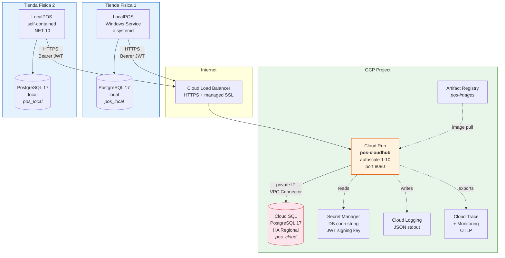
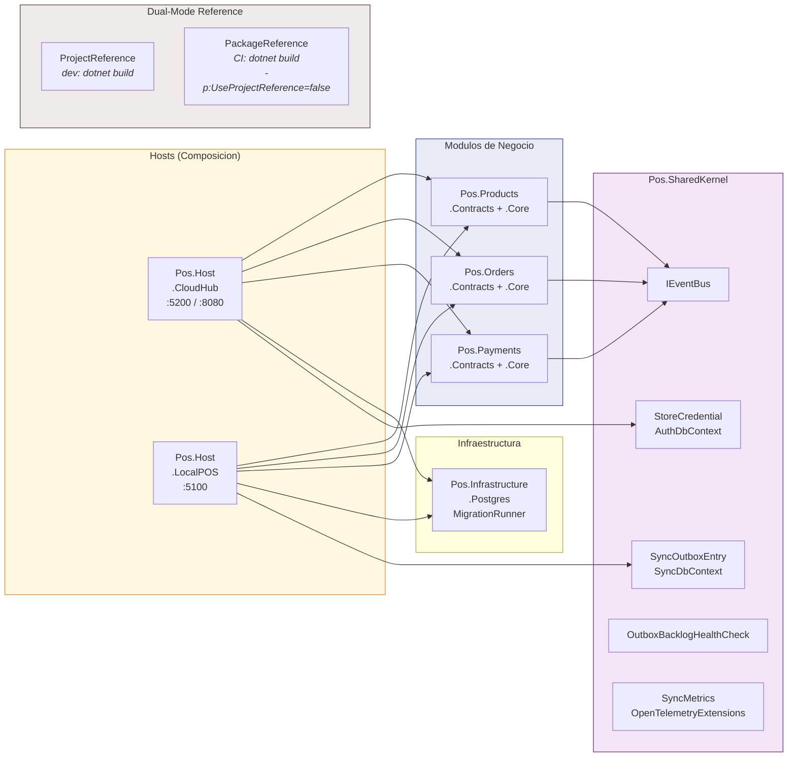
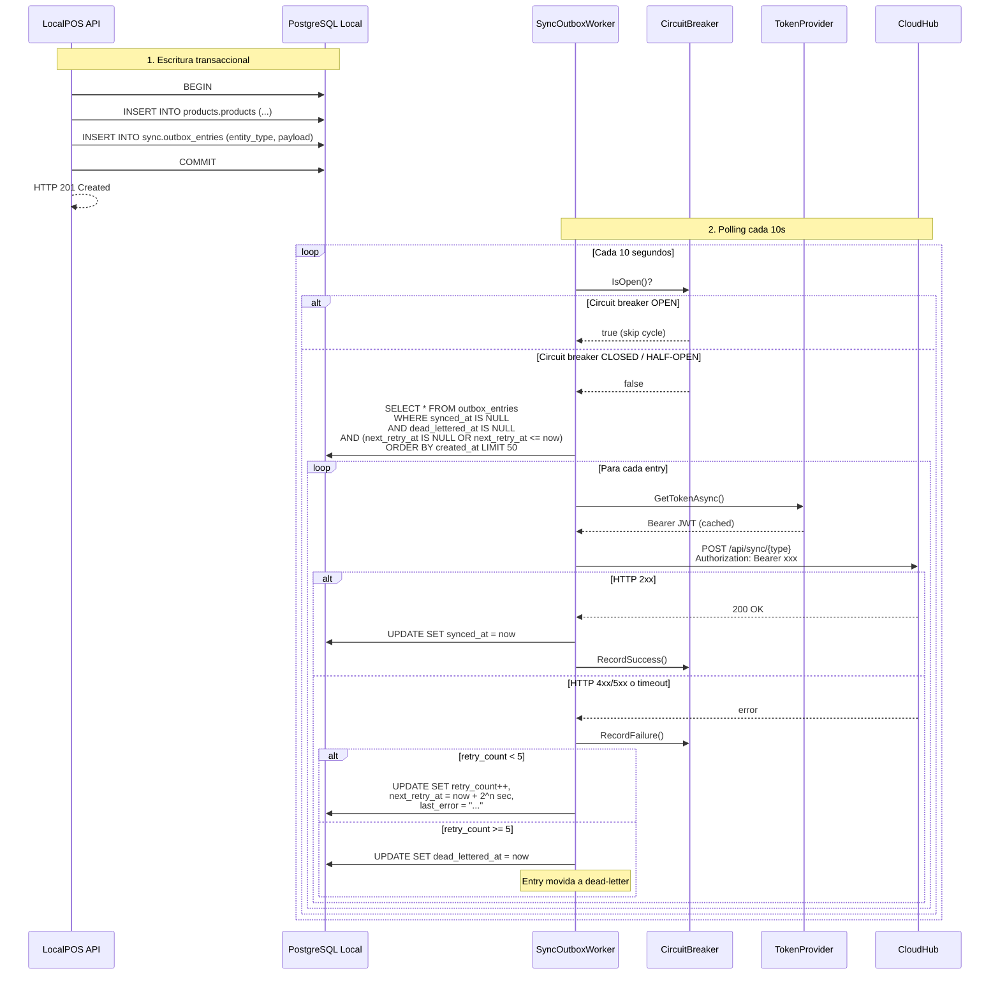
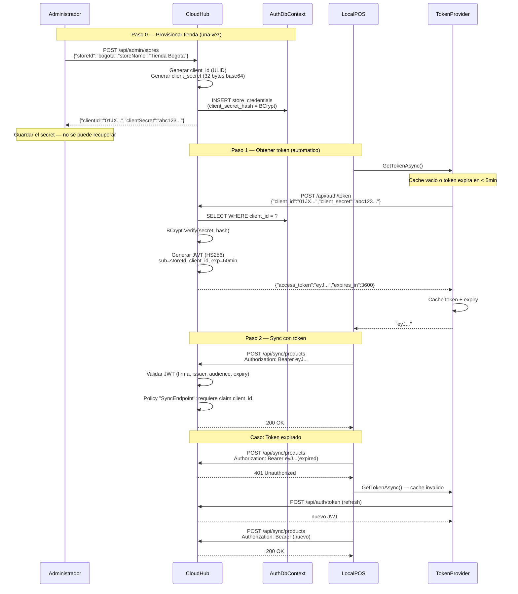
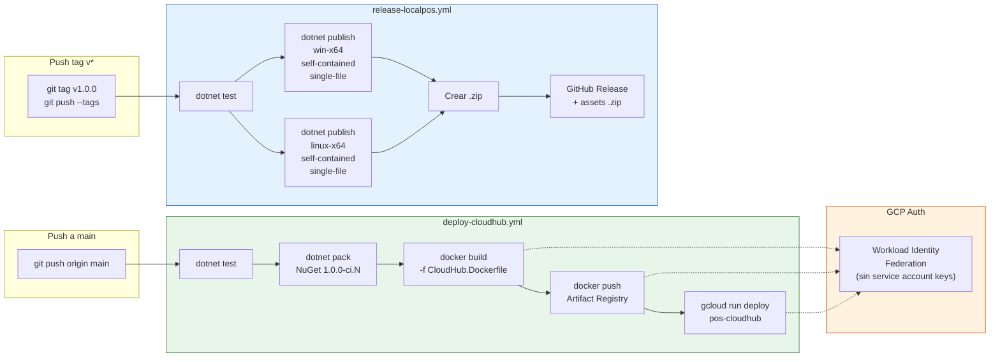
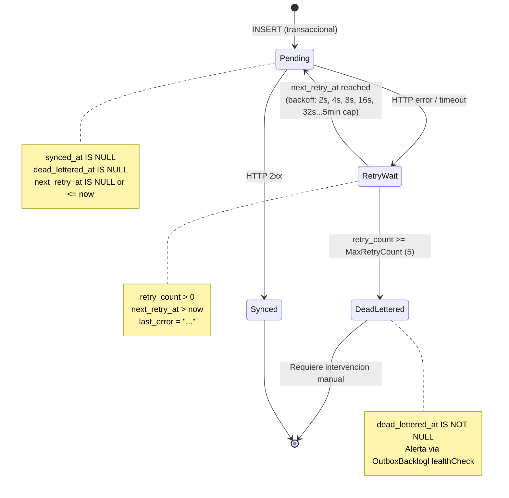
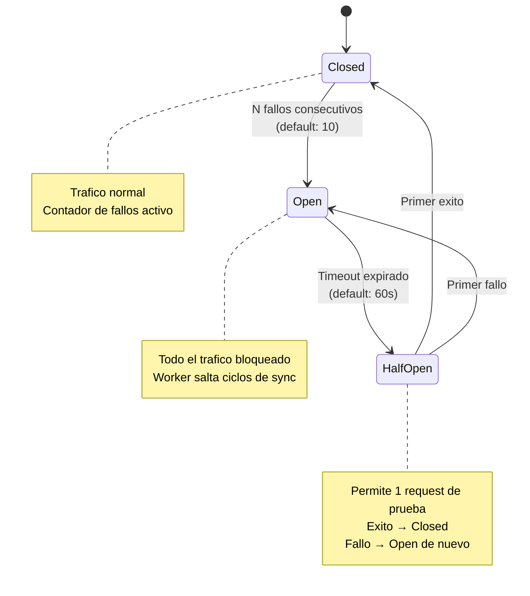
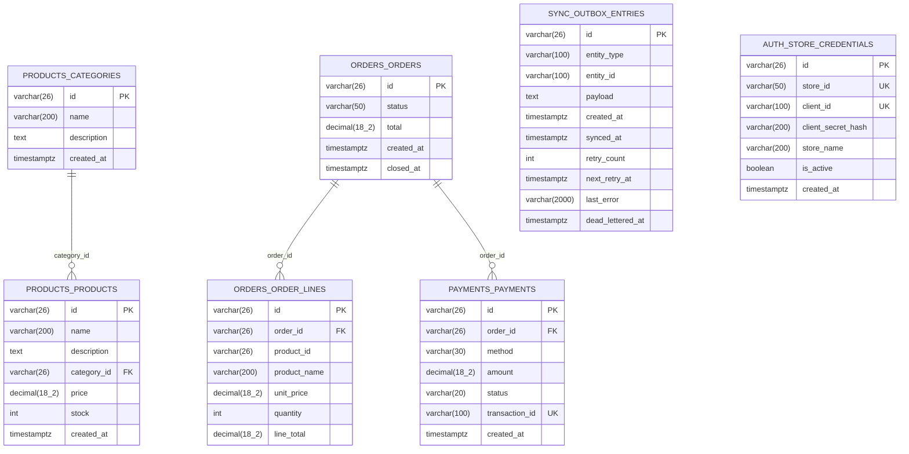
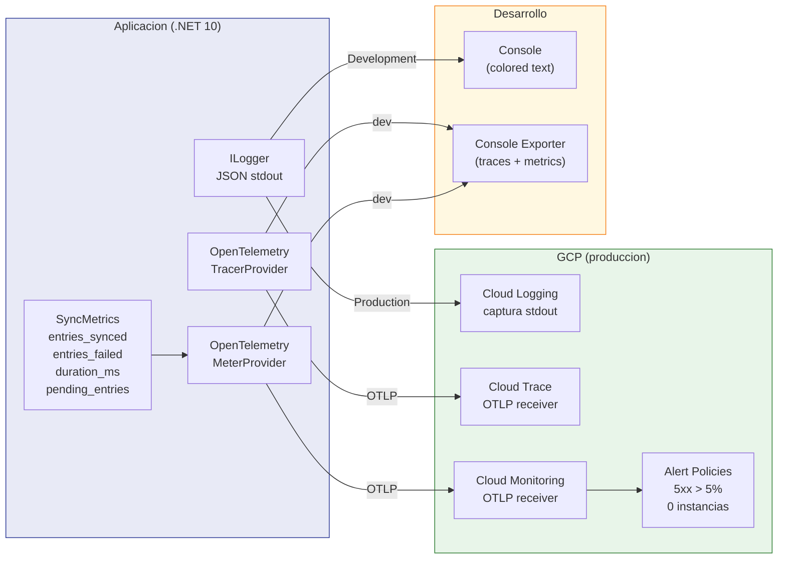
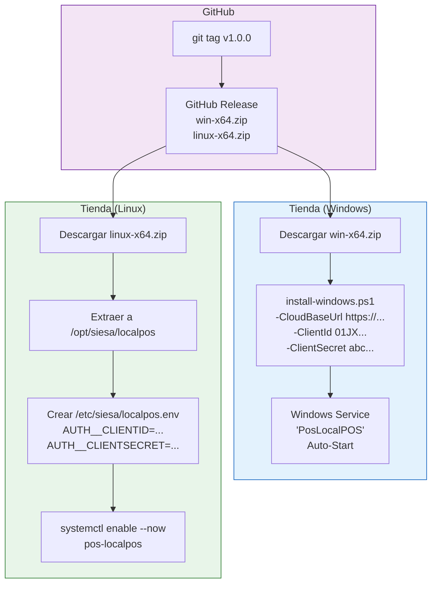

# Diagramas de Arquitectura — SIESA POS

> Todos los diagramas usan sintaxis [Mermaid](https://mermaid.js.org/) y se renderizan
> directamente en GitHub, GitLab, Notion, y la mayoria de viewers Markdown.

---

## 1. Topologia del Sistema

Vista general: CloudHub en GCP Cloud Run, tiendas fisicas con LocalPOS on-premise.

---

## 2. Arquitectura de Modulos (NuGet Dual-Mode)

Cada modulo se distribuye como paquete NuGet. Los hosts los componen sin conocer su implementacion interna.

---

## 3. Flujo de Sincronizacion (Outbox Pattern)

Datos creados en LocalPOS se sincronizan al CloudHub via HTTP push con backoff exponencial.

---

## 4. Flujo de Autenticacion (OAuth2 Client Credentials)

Cada tienda tiene un `client_id` + `client_secret`. El CloudHub emite JWTs.

---

## 5. Pipeline CI/CD

Dos workflows en GitHub Actions: uno para CloudHub (push a main) y otro para LocalPOS (tags de release).

---

## 6. Resiliencia del Outbox

Estado de las entries y transiciones del circuit breaker.

### Circuit Breaker

---

## 7. Modelo de Datos

Schemas en PostgreSQL (tanto `pos_cloud` como `pos_local`).

> **Nota:** `sync.outbox_entries` solo existe en `pos_local`. `auth.store_credentials` solo existe en `pos_cloud`.

---

## 8. Observabilidad

Flujo de señales: logs, traces y metricas.

---

## 9. Flujo de Despliegue de LocalPOS

Instalacion en tiendas fisicas (Windows o Linux).

